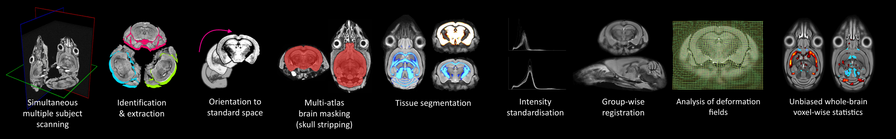
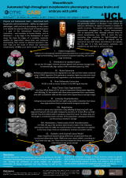

MouseMorph
==========

_We're not quite done here, but please get in touch if you are interested: nicholas.powell.11@ucl.ac.uk._

Tools for MRI mouse brain morphometry.

MouseMorph is a modular set of tools for automatically analysing mouse brain MRI scans. It enables fully automatic [Voxel- and Tensor-Based Morphometry][ashb_vbm_2000] (VBM, TBM) on large cohorts of high-resolution images. It is employed at the UCL Centre for Advanced Biomedical Imaging ([CABI][CABI]) for [phenotyping](http://en.wikipedia.org/wiki/Phenotype) mice based on *in vivo* and *ex vivo* MRI. It has been tested for robustness on hundreds of mouse brain scans.

The primary distinction from clinically-focussed tools like [SPM](http://www.fil.ion.ucl.ac.uk/spm/) and [FSL](http://fsl.fmrib.ox.ac.uk/fsl/fslwiki/) is a robust set of pre-processing steps, unique to -- or with customisations for -- the preclinical paradigm (mice and rats):
- Identification and extraction of multiple subjects from a single scan image
- Orientation to a standard space, from any initial orientation
- Mouse brain extraction (skull stripping / brain masking)
- Tissue segmentation, using accurate, mouse-specific priors
- Group-wise registration

Most of these steps are atlas-based (requiring prior knowledge). A few mouse atlases, fulfilling this requirement, are freely available to download (see links below). We aim to release more. For a further introduction, see the [**poster**][mm_poster]. For links to open and free wild-type mouse brain MRI data, see below.

Developed at the [UCL Centre for Medical Image Computing (CMIC)][CMIC] and the [UCL Centre for Advanced Biomedical Imaging (CABI)][CABI] by Nick Powell (nicholas.powell.11@ucl.ac.uk) and others.

[][mm_poster] [")][tc1_paper] [")][tg4510_holmes_paper] [")][tg4510_wells_paper]

## Phenotyping
If you are interested in using MouseMorph to assist a phenotyping study, please get in touch!

### Multiple mouse brain MRI
- See the brain holder in this repository (stl folder), or at [Figshare](https://figshare.com/articles/CABI_Mouse_Brain_Holder/1290771) (please cite: https://dx.doi.org/10.6084/m9.figshare.1290771)

## Setup
1. Download, and install, [NiftyReg], and [NiftySeg]. Ensure the executables are on your system path ([Linux](http://www.computerhope.com/issues/ch001647.htm); [Windows](http://www.computerhope.com/issues/ch000549.htm))
2. You need at least Python 2.7. Try [Anaconda], which includes the required NumPy, SciPy, Pandas, Matplotlib.
3. You also need [NiBabel]. From a command line, run: `pip install nibabel`
3. [Download the MouseMorph repository as a .zip](https://github.com/nmpowell/mousemorph/archive/master.zip), and extract
4. From the mousemorph directory, run: `python setup.py install`

## Publications
MouseMorph has been used in several peer-reviewed publications:
- Powell, NM., Modat, M., Cardoso, MJ., Ma, D., Holmes, HE., Yu, Y., O’Callaghan, J., Cleary, JO., Sinclair, B., Wiseman, FK., Tybulewicz, VLJ., Fisher, EMC., Lythgoe, MF., Ourselin, S. (2016). ***Fully-automated µMRI morphometric phenotyping of the Tc1 mouse model of Down syndrome.*** PLoS ONE 11(9): e0162974. [doi:10.1371/journal.pone.0162974][tc1_paper]
- Holmes, HE., Colgan, N., Ismail, O., Ma, D., Powell, NM., O’Callaghan, JM., Harrison, IF., Johnson, RA., Murray, TK., Ahmed, Z., Heggenes, M., Fisher, A., Cardoso, MJ., Modat, M., Walker-Samuel, S., Fisher, EMC., Ourselin, S., O’Neill, MJ., Wells, JA., Collins, EC., Lythgoe, MF. (2016). ***Imaging the accumulation and suppression of tau pathology using multi-parametric MRI.*** Neurobiology of Aging. [doi:10.1016/j.neurobiolaging.2015.12.001][tg4510_holmes_paper]
- Wells, JA., O’Callaghan, JM., Holmes, HE., Powell, NM., Johnson, RA., Siow, B., Torrealdea, F., Ismail, O., Walker-Samuel, S., Golay, X., Rega, M., Richardson, S., Modat, M., Cardoso, MJ., Ourselin, S., Schwarz, AJ., Ahmed, Z., Murray, TK., O’Neill, MJ., Collins, EC., Colgan, N., Lythgoe, MF. (2015). ***In vivo imaging of tau pathology using multi-parametric quantitative MRI.*** NeuroImage, 111, 369–378. [doi:10.1016/j.neuroimage.2015.02.023][tg4510_wells_paper]

## Links
- [UCL Centre for Medical Image Computing (CMIC)][CMIC]
- [UCL Centre for Advanced Biomedical Imaging (CABI)][CABI]

### CMIC software
- [NiftyReg], for registration
- [NiftySeg], for segmentation
- [Mouse brain parcellation](https://github.com/dancebean/multi-atlas-segmentation)
- more [Nifty tools](http://cmic.cs.ucl.ac.uk/home/software/)

### Mouse atlases
Multi-subject atlases are preferred.

- [NUS Mouse Atlas (Singapore)](http://www.bioeng.nus.edu.sg/cfa/mouse_atlas.html)
- [MRM NeAt Mouse Atlas (Florida)](http://brainatlas.mbi.ufl.edu/)

© 2014 Nick Powell and [University College London](http://www.ucl.ac.uk/), UK. [License](https://github.com/nmpowell/mousemorph/blob/master/LICENSE).

[mm_poster]: docs/Nick_Powell-20131016-MouseMorph_MRI_Mouse_Phenotyping-Poster_A0_portrait.pdf
[tc1_paper]: http://journals.plos.org/plosone/article?id=10.1371/journal.pone.0162974
[tg4510_holmes_paper]: http://www.sciencedirect.com/science/article/pii/S0197458015006053
[tg4510_wells_paper]: http://www.sciencedirect.com/science/article/pii/S105381191500124X
[CMIC]: http://cmic.cs.ucl.ac.uk/ "UCL Centre for Medical Image Computing"
[CABI]: http://www.ucl.ac.uk/cabi "UCL Centre for Advanced Biomedical Imaging"
[ashb_vbm_2000]: http://www.fil.ion.ucl.ac.uk/~karl/Voxel-Based%20Morphometry.pdf "(PDF) Ashburner (2000): Voxel-Based Morphometry --- The Methods"
[NiftyReg]: http://sourceforge.net/projects/niftyreg/
[NiftySeg]: http://sourceforge.net/projects/niftyseg/
[Anaconda]: https://www.continuum.io/downloads
[NiBabel]: http://nipy.org/nibabel/