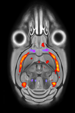

MouseMorph
==========

_We're not quite done here, but please get in touch if you are interested: nicholas.powell.11@ucl.ac.uk ..._

Tools for MRI mouse brain morphometry.

MouseMorph is a modular set of tools for automatically analysing mouse brain MRI scans. It enables fully automatic [Voxel- and Tensor-Based Morphometry][ashb_vbm_2000] (VBM, TBM) on large cohorts of high-resolution images. It is employed at the UCL Centre for Advanced Biomedical Imaging (CABI) for [phenotyping](http://en.wikipedia.org/wiki/Phenotype) mice based on *in vivo* and *ex vivo* MRI scans. It has been tested for robustness on hundreds of mouse brain scans.

The primary distinction from clinically-focussed tools like [SPM](http://www.fil.ion.ucl.ac.uk/spm/) and [FSL](http://fsl.fmrib.ox.ac.uk/fsl/fslwiki/) is a robust set of pre-processing steps, unique to -- or with customisations for -- the preclinical paradigm (mice and rats):
- Identification and extraction of multiple subjects from a single scan image
- Orientation to a standard space, from any initial orientation
- Mouse brain extraction (skull stripping / brain masking)
- Tissue segmentation
- Group-wise registration

Most of these steps are atlas-based (requiring prior knowledge). A few mouse atlases, fulfilling this requirement, are freely available to download (see links below). We aim to release more. For a further introduction, see the [**poster**][mm_poster]. For links to open and free wild-type mouse brain MRI data, see below.

Developed at the [UCL Centre for Medical Image Computing (**CMIC**)][cmic] and the [UCL Centre for Advanced Biomedical Imaging (**CABI**)][cabi] by Nick Powell (nicholas.powell.11@ucl.ac.uk) and others.

[][mm_poster]

## Phenotyping
If you are interested in using MouseMorph to assist a phenotyping study, please get in touch!

## Links
- [UCL Centre for Medical Image Computing (CMIC)][cmic]
- [UCL Centre for Advanced Biomedical Imaging (CABI)][cabi]

### CMIC software
- [NiftyReg](http://sourceforge.net/projects/niftyreg/)
- [NiftySeg](http://sourceforge.net/projects/niftyseg/)
- [Mouse brain parcellation](https://github.com/dancebean/multi-atlas-segmentation)
- more [Nifty tools](http://cmic.cs.ucl.ac.uk/home/software/)

### Mouse atlases
Multi-subject atlases are preferred.

- [NUS Mouse Atlas (Singapore)](http://www.bioeng.nus.edu.sg/cfa/mouse_atlas.html)
- [MRM NeAt Mouse Atlas (Florida)](http://brainatlas.mbi.ufl.edu/)

© 2014 Nick Powell and [University College London](http://www.ucl.ac.uk/), UK

[mm_poster]: docs/Nick_Powell-20131016-MouseMorph_MRI_Mouse_Phenotyping-Poster_A0_portrait.pdf
[cmic]: http://cmic.cs.ucl.ac.uk/ "UCL Centre for Medical Image Computing"
[cabi]: http://www.ucl.ac.uk/cabi "UCL Centre for Advanced Biomedical Imaging"
[ashb_vbm_2000]: http://www.fil.ion.ucl.ac.uk/~karl/Voxel-Based%20Morphometry.pdf "(PDF) Ashburner (2000): Voxel-Based Morphometry --- The Methods"